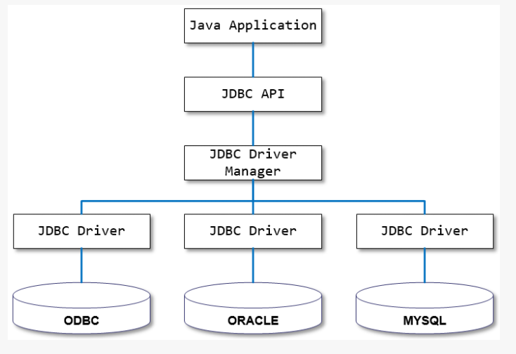
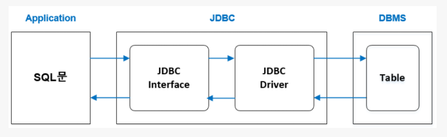
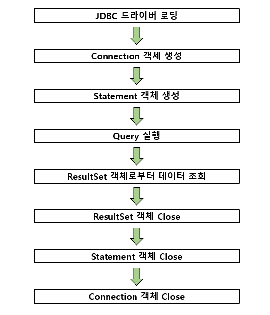
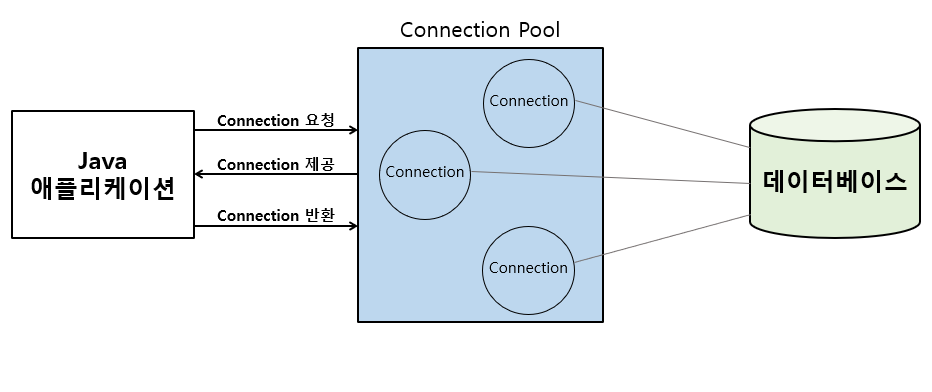

# JDBC

### JDBC란?
---

**JDBC**(Java Database Connectivity)는 Java 기반 애플리케이션의 데이터를 데이터베이스에 저장 및 업데이트하거나, 데이터베이스에 저장된 데이터를 Java에서 사용할 수 있도록 하는 자바 API이다.
 
JDBC는 Java 애플리케이션에서 데이터베이스에 접근하기 위해 JDBC API를 사용하여 데이터베이스에 연동할 수 있으며, 데이터베이스에서 자료를 쿼리(Query)하거나 업데이트하는 방법을 제공한다.

### JDBC의 구조
---

JDBC는 크게 JDBC 인터페이스와 드라이버로 구성된다. 
애플리케이션에서는 SQL문을 만들어 JDBC 인터페이스에 전송하고 실제 구현 클래스인 JDBC 드라이버(데이터베이스와의 통신을 담당하는 인터페이스, 데이터베이스에 알맞은 JDBC 드라이버를 구현하여 제공)에서는 DBMS와 접속을 시도하고 SQL을 전송하는 구조를 가진다.
 
또한, DBMS에서 나온 결과를 역으로 거쳐 애플리케이션으로 가져오는 역할을 JDBC가 하기 때문에
애플리케이션과 DBMS의 다리 역할을 한다고 생각하면 된다.

### JDBC의 사용 흐름
---

- JDBC 드라이버 로딩 : 사용하고자 하는 JDBC 드라이버를 로딩한다. JDBC 드라이버는 DriverManager 클래스를 통해 로딩된다.
- Connection 객체 생성 : JDBC 드라이버가 정상적으로 로딩되면 DriverManager를 통해 데이터베이스와 연결되는 세션(Session)인 Connection 객체를 생성한다.
- Statement 객체 생성 : Statement 객체는 작성된 SQL 쿼리문을 실행하기 위한 객체로 정적 SQL 쿼리 문자열을 입력으로 가진다.
- Query 실행 : 생성된 Statement 객체를 이용하여 입력한 SQL 쿼리를 실행한다.
- ResultSet 객체로부터 데이터 조회 : 실행된 SQL 쿼리문에 대한 결과 데이터 셋이다.
ResultSet, Statement, Connection 객체들의 Close : JDBC API를 통해 사용된 객체들은 생성된 객체들을 사용한 순서의 역순으로 Close 한다.

### 커넥션 풀이란?
---

JDBC API를 사용하여 데이터베이스와 연결하기 위해 Connection 객체를 생성하는 작업은 비용이 많이 드는 작업 중 하나이다. 커넥션을 새로 만드는 것은 비용이 많이 들며, 비효율적이다. 
이러한 문제를 해결하기 위해 애플리케이션 로딩 시점에 Connection 객체를 미리 생성하고, 애플리케이션에서 데이터베이스에 연결이 필요할 경우 미리 준비된 Connection 객체를 사용하여 애플리케이션의 성능을 향상하는 커넥션 풀(Connection Pool)이 등장하게 된다. 
Connection 객체를 미리 생성하여 보관하고 애플리케이션이 필요할 때 꺼내서 사용할 수 있도록 관리해 주는 것이 Connection Pool이다.
